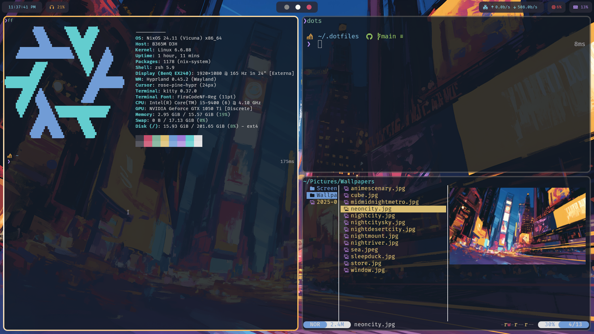

# dotfiles

<p align="center">
  
</p>
This repository contains my personal dotfiles, designed to set up a consistent efficient and aesthetic environment across my systems.

## ⚙️ Installation

These dotfiles are managed using [GNU Stow](https://www.gnu.org/software/stow/), which simplifies the process of symlinking configuration files to your home directory.

## ⚠️ Notes on Compatibility

These dotfiles were created specifically for [NixOS](https://nixos.org/) + [Hyprland](https://hyprland.org/), and therefore may include configurations that are unnecessary or irrelevant for other distributions like Ubuntu or Linux Mint.  Please go through the **Repo** and understand what all configs are currently set. If you're unsure about certain configs, it's recommended to leave them as is or better remove the irrelevant  folders from the cloned repo before applying Stow. (ps: config folders usually are hidden by default in file managers)

### Prerequisites

Ensure that GNU Stow is installed on your system. You can install it using your package manager. For example:

- **Arch Linux**:
  ```bash
  sudo pacman -S stow
  ```
- **Debian/Ubuntu**:
  ```bash
  sudo apt-get install stow
  ```

## 💡 Usage

1. **Clone the Repository**:
   ```bash
   git clone https://github.com/13inilb/dotfiles.git ~/dotfiles
   cd ~/dotfiles
   ```

2. **Apply All Configurations**:
   From the root of the cloned repository (`~/dotfiles`), run:
   ```bash
   stow .
   ```

   This will symlink all the files and folders to your home directory, preserving their relative paths.

   ⚠️ **Warning**: This operation can overwrite your existing configuration files (like `.zshrc`, `.config/nvim/init.vim`, etc.) if they already exist in your home directory.  
   To **avoid losing your current setup**, consider backing up any important config files before running the above command:
   ```bash
   cp ~/.zshrc ~/.zshrc.backup
   cp -r ~/.config ~/.config.backup
   ```

   Alternatively, you can stow specific components individually (e.g.):
   ```bash
   stow zsh
   stow config
   ```


## 🛠️ Customization

Feel free to modify these configurations to suit your preferences.  
(Each configuration file will be documented soon.)

